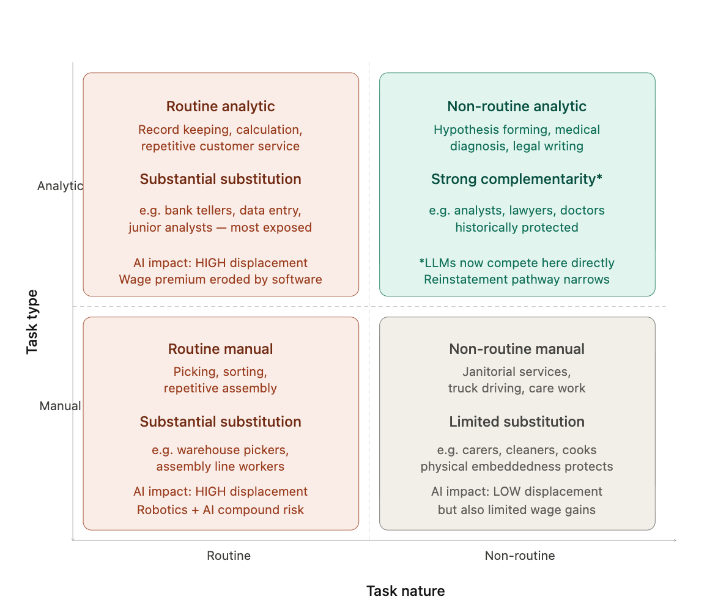

# Managing AI's Transition Gap: A Labour Market Policy Proposal for Australia

**To:** Deputy Secretary, Employment & Skills,
Department of Employment and Workplace Relations (DEWR)

**Author:** Truong Minh Ngoc (s4055333)

**Date:** April 2026

---

## Executive Summary

AI will not collapse the Australian labour market. The risk is more precise: displacement will occur faster than workers can transition, it will fall disproportionately on ***middle-skill cohorts least able to absorb income shocks***, and the resulting productivity gains will accrue primarily to **capital rather than wages**.

This asymmetry of speed, distribution, and capture is the **core policy failure**. Yet current settings address none of its dimensions. This proposal sets out four coordinated responses:

| Response | Purpose |
|---|---|
| **Wage insurance** | Stabilises incomes at the point of displacement |
| **Demand-verified reskilling** | Redirects workers into occupations with proven labour shortages |
| **AI complementarity investment** | Creates new roles in public services where private demand is insufficient |
| **Productivity levy** | Funds the system without competing against general revenue |

Implemented over seven years, the package costs **$1.74–2.08 billion**, around *0.2% of the estimated $0.8 trillion GDP loss under no intervention*. The objective is not to slow AI adoption, but to ensure its gains are **broadly distributed** rather than structurally concentrated.

---

## I. Context and Problem Identification

Generative AI changes how work is organised at a system level. McKinsey (2024) estimates **60–70% of work activities are technically automatable**; the IMF (2024) projects **40% of global jobs are already exposed**. These figures signal scale, but policy depends on the mechanism behind them.

Three forces drive the risk. First, the displacement-reinstatement balance was already deteriorating before AI arrived — since 1987 (Acemoglu and Restrepo 2019) — leaving less margin for adjustment. Second, unlike prior automation waves, AI now threatens skilled and judgement-intensive roles, eroding the segments that *historically absorbed displaced workers* on the way down (Autor et al. 2003). Third, productivity gains are structurally captured as capital returns, breaking the transmission from productivity to household income to new demand.

The adjustment is ***asymmetric***. Displacement is rapid and concentrated, while reinstatement is slower and diffuse. Income losses arrive immediately; gains are realised elsewhere and later. This divergence is the **market failure** the proposal addresses.

*Each channel through which AI produces this failure is examined next.*

---

## II. Impact Analysis

AI affects the labour market through **one mechanism**: it replaces tasks faster than the economy creates new ones, weakening four adjustment channels in sequence.

---

### Tasks

The ALM framework (2003) showed early automation displacing routine tasks while preserving an upward pathway into non-routine analytic roles. ***AI removes that pathway.*** Modern systems now perform reasoning and language tasks, with **44–46% of legal tasks automatable** (Olah 2023). As higher-skill tasks are substituted, the destination pool for displaced workers shrinks while displacement simultaneously moves up the skill distribution.

Workers most exposed — *middle-skill, mid-career, mid-income* — face the highest reskilling costs, lowest geographic mobility, and longest reinstatement windows. This is a failure with a **tight demographic profile**, and it demands a targeted response.

  

<em>Figure 1: The ALM taxonomy framework by Autor, Levy and Murnane (2003). Generated by Claude, 2026.</em>

---

### Employment

Jobs are not eliminated immediately because AI still fails at tacit judgement, so a human boundary remains (Dell'Acqua et al. 2023). Instead, firms automate routine tasks and retain human ones, achieving the same output with fewer high-value roles.

Stable unemployment therefore **masks occupational downgrading**. Adjustment occurs *within* employment rather than through job loss — which is precisely why aggregate statistics miss it, and why standard unemployment policy is the wrong instrument.

---

### Wages

Productivity gains are real, but ***the transmission to wages is broken***. When firms substitute labour with capital, returns flow to owners rather than workers.

The **"so-so technology"** dynamic (Acemoglu and Restrepo 2019) compounds this: firms adopt AI in professional services not because it produces better outcomes, but because it is *cheaper than junior labour*. Output gains are overstated, while workers absorb the cost of inefficient capital replacing them.

---

### Industry Structure

At scale, AI allows output to grow without hiring, shifting industries toward capital-intensive production. Because adoption occurs across sectors simultaneously, displaced workers cannot relocate to absorb labour elsewhere.

The result is ***growth without jobs and profit without wage growth*** — economy-wide, not sector-specific.

*These four failures demand four distinct instruments; what follows develops and evaluates them.*

---

## III. Policy Options

Before any option deploys, eligibility must exist. Individual proof of AI displacement is not viable. The proxy framework operates on three criteria, any one sufficient: redundancy in JSA's five highest-exposure occupations; firm disclosure linking AI adoption to headcount reduction; or sectoral contraction exceeding **5% AI-attributable job loss within 12 months**. Over-inclusion is acceptable — excluding a displaced worker costs more than supporting a misclassified one.

Options are evaluated against five criteria: *causal alignment* (does it target the mechanism, not the symptom?), *target precision* (does it reach the right workers?), *reinstatement effect* (does it create new roles?), *equity* (does it reach the most exposed?), and *fiscal efficiency* (is cost proportionate to outcomes?).

### Comparative Summary

| Criterion | Option 1: Wage Insurance | Option 2: Reskilling | Option 3: Complementarity | Option 4: Levy |
|---|---|---|---|---|
| Causal alignment | Low | Moderate | High | **Highest** |
| Target precision | High | Moderate | High | Moderate |
| Reinstatement effect | None | Moderate | High | Indirect |
| Equity | High | Moderate | High | High |
| Fiscal efficiency | Moderate | Moderate | Low–Moderate | **Revenue-generating** |

---

### Option 1: AI Displacement Wage Insurance

Workers in JSA's five highest-exposure occupations who re-enter employment at lower pay receive a **50% government top-up on the wage gap for 24 months, capped at $25,000**. It is the fastest option to deploy, built on existing Workforce Australia infrastructure. The 24-month window is calibrated to the average Australian retraining horizon under VET/TAFE programs (12–18 months), plus a 6-month job-search buffer.

If re-employment data shows <60% placement at 18 months, the cap extends and Option 3 deployment accelerates. But it finances the transition interval without shortening it. Without Options 2 and 3 operational behind it, ***it is a bridge to nowhere***.

| Criterion | Rating | Justification |
|---|---|---|
| Causal alignment | Low | Compensates for income loss; does not fix wage transmission failure |
| Target precision | High | Proxy framework delivers occupational and sectoral targeting |
| Reinstatement effect | None | Creates no new roles; finances interval only |
| Equity | High | Wage-proportionate design protects mid-income displaced workers |
| Fiscal efficiency | Moderate | $25,000 cap is defensible; cost scales with displacement rate |

---

### Option 2: Reskilling Based on Real Job Demand

Displaced workers receive fully-funded VET/TAFE training into occupations with **JSA-projected growth above 3%**: aged care at *+15.4% by 2030* is a clear destination. This corrects the National AI Plan's focus on tool literacy over job transition, and prevents funding flowing into fields where AI is already cutting roles. The constraint is timing: demand can shift within 18 months, requiring annual updates to remain accurate.

| Criterion | Rating | Justification |
|---|---|---|
| Causal alignment | Moderate | Addresses skill mismatch; cannot fix wage transmission or concentration |
| Target precision | Moderate | Demand threshold reduces misallocation; destination uncertainty remains |
| Reinstatement effect | Moderate | Prepares workers for reinstatement but does not create the roles itself |
| Equity | Moderate | Targets high-exposure workers, but misses lower-exposure roles |
| Fiscal efficiency | Moderate | Cost-effective if destinations hold; wasteful if AI advances faster |

---

### Option 3: Using AI to Support Workers in Public Services

Government deploys AI in aged care, healthcare, and education to absorb administrative and documentation tasks, freeing workers for **relational work AI cannot perform**. Sectors are selected because complementarity is structural, labour shortages are acute, and private adoption has stalled. This is the ***only option that creates jobs directly***; AI absorbs administrative burden, each worker serves more clients, and expanded capacity requires more workers. Cost is high and returns materialise over years; pilots must precede scale.

| Criterion | Rating | Justification |
|---|---|---|
| Causal alignment | High | Addresses reinstatement deficit and so-so technology dynamic |
| Target precision | High | Sector selection based on verified labour shortage data |
| Reinstatement effect | High | Creates role demand through productivity-driven service expansion |
| Equity | High | Productivity-linked wage improvements |
| Fiscal efficiency | Low–Moderate | High upfront cost; returns materialise over years, not months |

---

### Option 4: AI Productivity Levy

Firms that reduce headcount through AI pay a levy **hypothecated directly to the transition fund**. Firms that maintain or grow headcount are exempt, creating a direct incentive against so-so substitution. This follows established Australian policy logic (the Major Bank Levy, the MRRT) and is ***the only option that addresses the root cause*** while self-funding the rest of the package.

| Criterion | Rating | Justification |
|---|---|---|
| Causal alignment | Highest | Addresses root cause: capital capturing labour productivity value |
| Target precision | Moderate | Firm disclosure links levy to verified adoption |
| Reinstatement effect | Indirect | Funds reinstatement mechanisms; does not create roles directly |
| Equity | High | Redistributes AI productivity gains to displaced workers |
| Fiscal efficiency | Revenue-generating | Funds Options 1–3 without competing against general revenue |

---

### Comparative Judgement

No single option is sufficient. Without funding, programs fail. Without job creation, training leads nowhere. Without training, workers cannot transition. Without income support, they cannot wait. ***The package is interdependent by design***, and must be sequenced accordingly.

**UBI fails this test.** It addresses income maintenance without touching skill mismatch, reinstatement deficit, or fiscal sustainability. At the cost of a meaningful UBI, this package delivers superior outcomes on all five criteria.

*The recommended deployment sequence for this package follows.*
